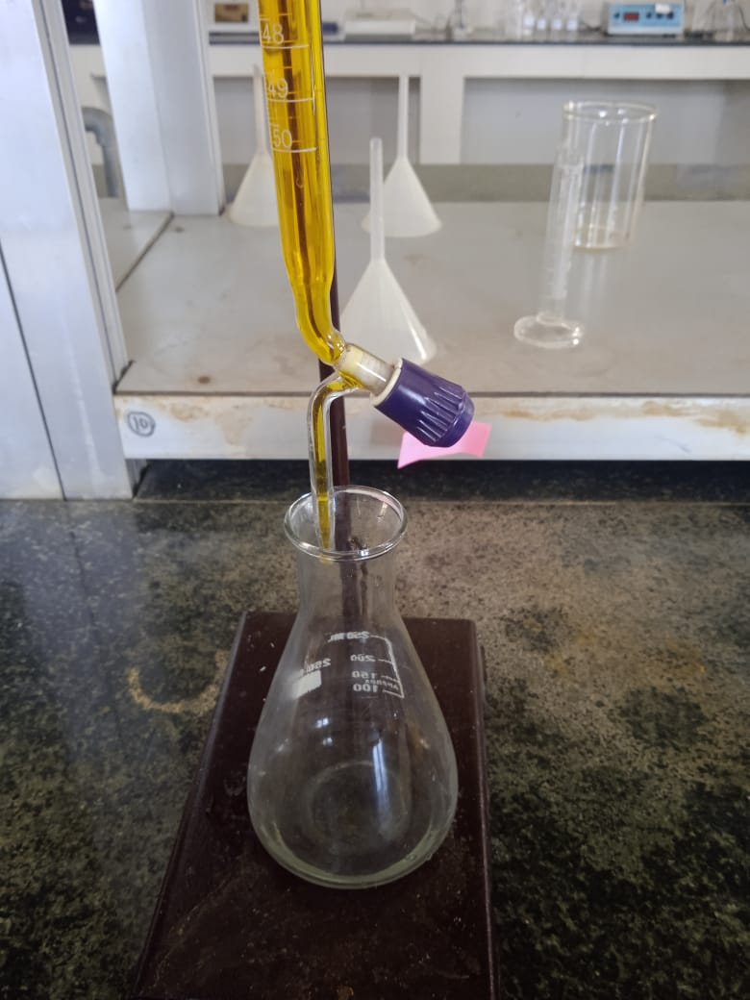
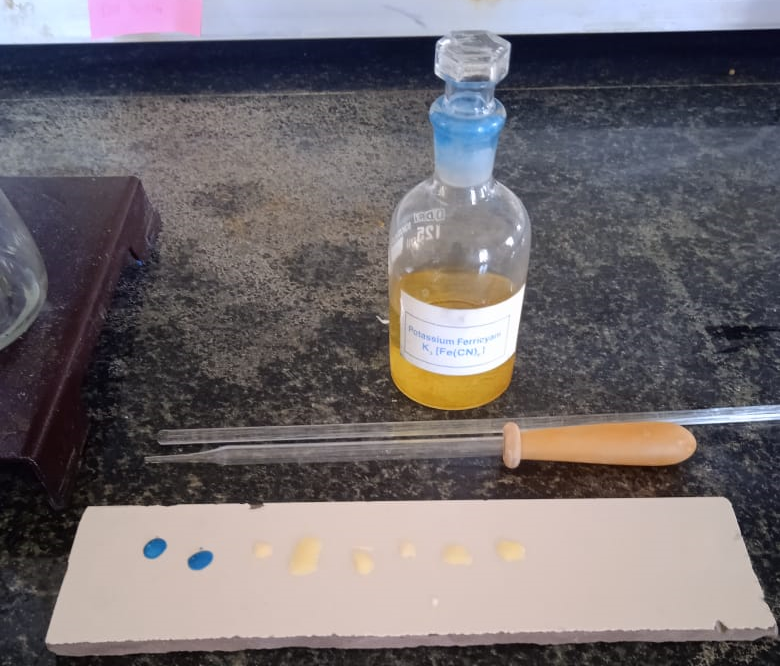

### **Introduction**

Potassium dichromate acts as an oxidizing agent (E⁰_red = +1.33 V) in the presence of an acid, and each molecule of it gives up three atoms of oxygen available for oxidation of the reducing agent. Potassium dichromate is a primary standard and is less powerful as an oxidizing agent than KMnO₄ (E⁰_red = +1.33 V). The oxidizing character of these species depends on the pH of the solution. KMnO₄ acts as an oxidizing agent in acidic, basic, and neutral media, but has the strongest oxidizing character in acidic medium. Unlike KMnO₄, K₂Cr₂O₇ behaves as an oxidizing agent only in acidic medium according to the following reaction:

 K2Cr2O7 + 4H2SO4 → K2SO4 + Cr(SO4)3 + 4H2O + 3[O]
 

When acidic K₂Cr₂O₇ is added an iron ore sample containing Fe²⁺ ions, Fe²⁺ gets oxidized to Fe³⁺ ions according to the following reaction:

 K2Cr2O7 + 4H2SO4 → K2SO4 + Cr(SO4)3 + 4H2O + 3[O]
 

In this titration, K₃Fe(CN)₆ is used as an external indicator. It gives a blue color upon reaction. If ferrous ions (Fe²⁺) are present, a strong blue color is developed due to:

2K3[Fe(CN)6] + FeSO4 → Fe3[Fe(CN)6]2 + 3K2SO4

At the end point, no Fe²⁺ ions are present in the solution, so the indicator fails to produce a blue color.

  
   <strong>Fig. 1 Titration of FAS solution against K₂Cr₂O₇ solution</strong>

  
   <strong>Fig. 2 K₃Fe(CN)₆ as an External Indicator</strong>

### **Applications of Determination of Ferrous Content**

1.Quality Control in Iron and Steel Production  
2.Metallurgical Process Optimization  
3.Environmental Monitoring and Compliance  
4.Research in Ore Characterization  
5.Educational Purposes in Chemistry Labs
